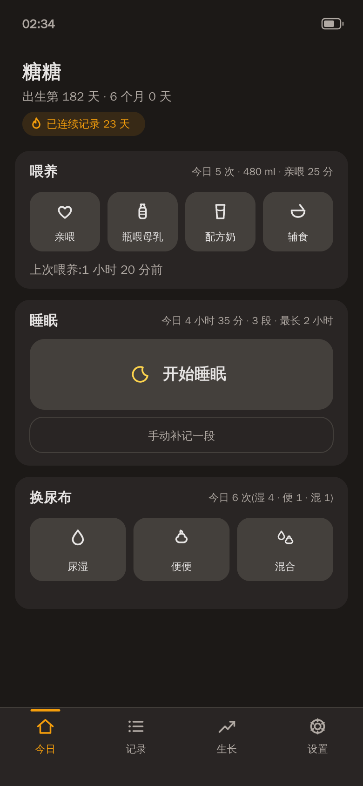
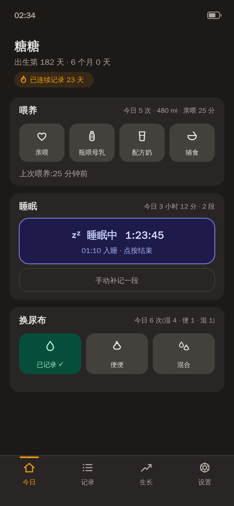
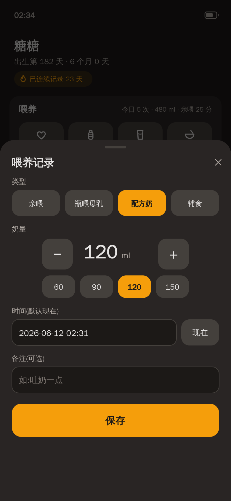
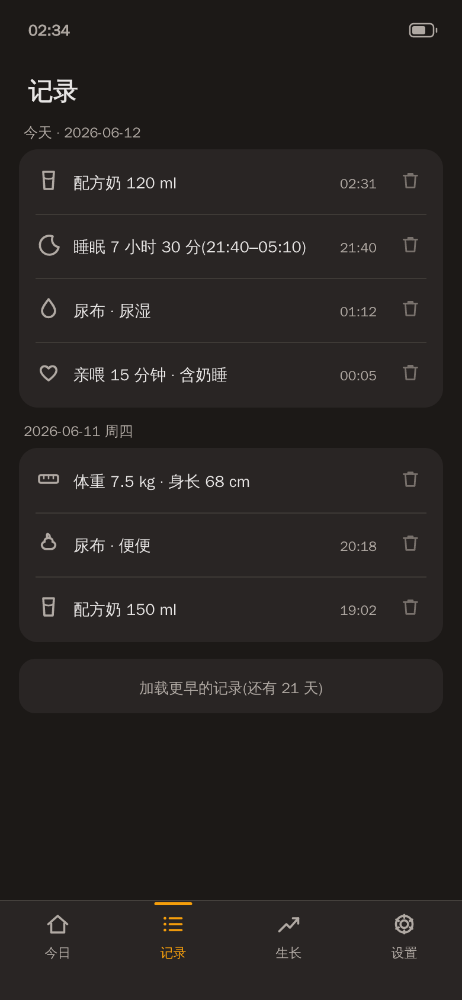
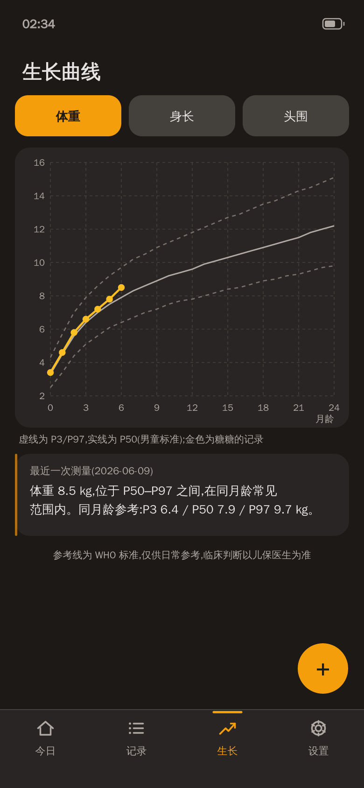
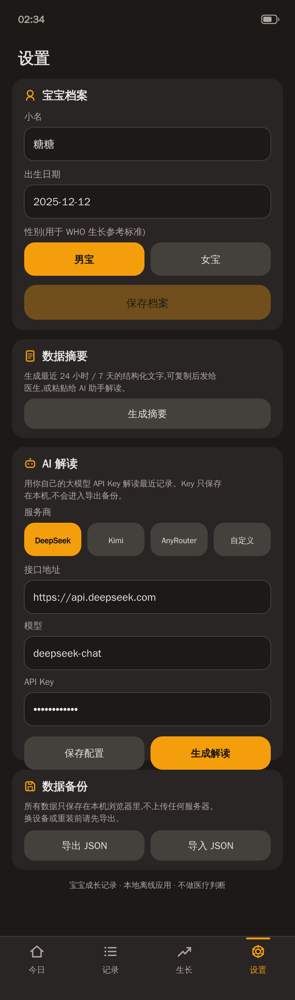
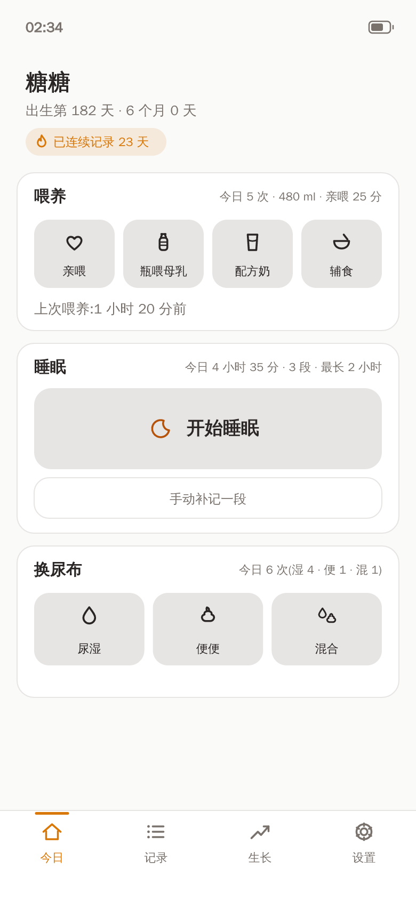
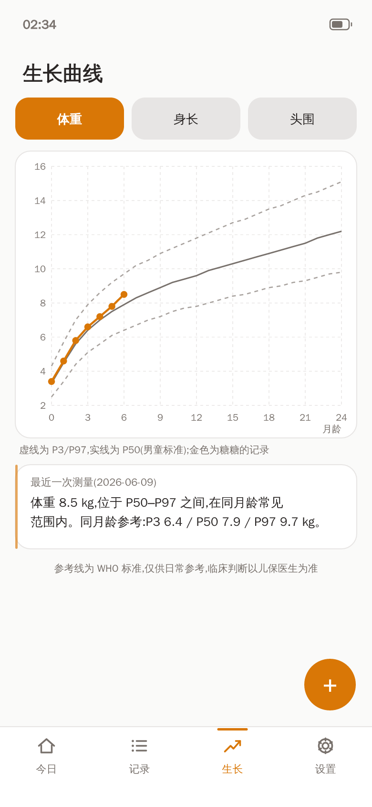
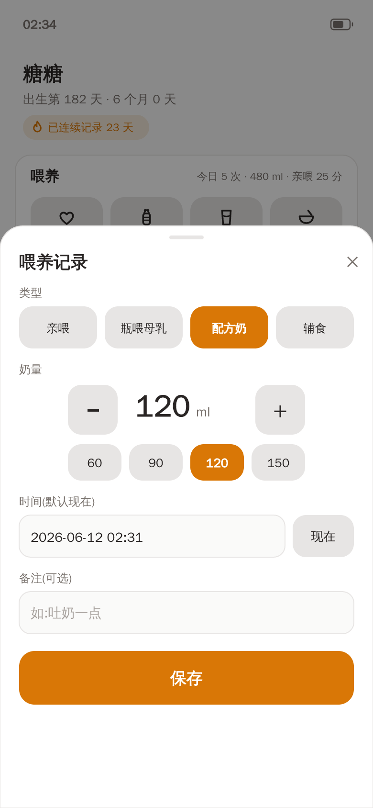

# 🌙 Baby Growth Tracker

**中文版本: [README.md](./README.md)**

A mobile-first tracking tool for families with babies aged 0–3: feeding, sleep, diapers, and growth curves.

**Local-first PWA** — all data lives in IndexedDB on your own device. No accounts, no backend, no analytics, no third-party SDKs. Fully usable offline, installable to the home screen. An optional AI-insight layer uses a BYOK model (bring your own API key) and supports DeepSeek / Kimi / AnyRouter plus any OpenAI- or Anthropic-compatible gateway.

Designed for one-handed use at 3 a.m.: a warm dark theme, ≥44px touch targets, and every core action within 2 taps.

## Screens

> Prototype renders using the app's actual design tokens (colors / radii / layout); in-app emoji are shown as vector glyphs here.

| Today (home) | Sleep in progress | Feed entry sheet |
| :---: | :---: | :---: |
|  |  |  |

| History (grouped by day) | Growth curves (WHO) | Settings |
| :---: | :---: | :---: |
|  |  |  |

Dark is the default (built for night feeds); a light theme and follow-system mode are one tap away in Settings:

| Light · Today | Light · Growth | Light · Feed sheet |
| :---: | :---: | :---: |
|  |  |  |

## Features

- **Feeding**: quick entry for nursing / pumped bottle / formula / solids; amount stepper (±10 ml) with 60/90/120/150 presets, defaulting to your last amount per type; daily count / total volume / time since last feed
- **Sleep**: one big start/stop button with a gentle breathing glow and a live seconds timer while in progress; manual backfill; overnight sleep is attributed to the day it started; daily total / segments / longest stretch
- **Diapers**: three big one-tap buttons (wet / dirty / mixed) with inline "saved ✓" feedback
- **Growth curves**: weight / length / head circumference; WHO 2006 P3 / P50 / P97 reference lines (sex-specific) plus the baby's own points, x-axis in months of age; the latest measurement gets a plain-language band description
- **Retention**: the home header shows "day N of life · X months Y days" and a "N-day recording streak" (a day without entries doesn't break the streak until the next day)
- **Themes**: dark (default) / light / follow-system; every semantic color is a CSS variable, so native controls and charts re-skin together
- **Material**: iOS-style frosted glass on floating surfaces (tab bar / sheets / dialogs / toast), gracefully falling back to opaque when `backdrop-filter` is unavailable or "Reduce Transparency" is on
- **Data sovereignty**: one-tap export / import of a complete JSON backup (strictly validated, double-confirmed); a "generate summary" button produces a structured 24h/7d text digest you can hand to a doctor or paste into any AI
- **AI insights (optional)**: call an LLM with your own key to get a restrained interpretation of recent records
- Every record supports edit and delete; deletion always asks for confirmation

## Architecture

| Layer | Choice |
| --- | --- |
| Framework | Vite + React 18 + TypeScript (no state library — hooks suffice) |
| Styling | Tailwind CSS, warm dark theme |
| Charts | recharts (lazy-loaded; initial bundle ≈ 90 KB gzip) |
| Persistence | Dexie (IndexedDB); all reads/writes go through a single `StorageAdapter` interface |
| PWA | vite-plugin-pwa (manifest + Service Worker precache, offline-capable) |
| LLM | plain `fetch`, unified OpenAI (`/chat/completions`) and Anthropic (`/v1/messages`) formats, zero SDKs |

```
src/
├── types.ts            # Data model (also the export-JSON schema, versioned)
├── storage/            # StorageAdapter interface + DexieAdapter (singleton assembly point)
├── lib/                # Pure functions: dates/age, WHO interpolation & bands,
│   │                   #   aggregation, summaries, backup validation
│   └── llm/            # Provider presets, request client, prompts, local config persistence
├── hooks/              # useCollection / useProfile / useNow (tiny event bus)
├── components/         # Module sections, edit sheets, shared UI primitives, toast
└── pages/              # Today / History / Growth / Settings + onboarding
```

Data model: `BabyProfile` / `Feed` / `Sleep` (`end=null` means in progress) / `Growth` / `Diaper` — see `src/types.ts`.

## Getting started

```bash
pnpm install
pnpm dev        # dev server (no Service Worker)
pnpm test       # vitest, 75 tests
pnpm typecheck  # TypeScript check
pnpm build      # outputs dist/ (manifest + SW included)
pnpm preview    # preview the production build; verify PWA install & offline
```

> To verify offline mode: `pnpm build && pnpm preview` → DevTools → Network → Offline → reload; all CRUD should keep working.

PWA icons are generated by `node scripts/gen-icons.mjs` (zero-dependency; outputs are committed). The UI mockups in `docs/mockups/` are script-generated as well.

## Deployment (Vercel)

1. Log in to [vercel.com](https://vercel.com) → **Add New → Project** → import this repository
2. The framework preset is auto-detected as **Vite** (build `pnpm build`, output `dist` — all defaults, no environment variables)
3. **Deploy**, then open the assigned domain on your phone and choose "Add to Home Screen"
4. Every `git push` redeploys automatically; the SW is in autoUpdate mode, so users get the new version on next launch

Netlify / Cloudflare Pages work the same way (pure static output; HTTPS is the only hard requirement).

**Note**: data lives on each device. Before switching phones, export the JSON backup in Settings and import it on the new device.

## AI insights (BYOK)

Settings → AI 解读: pick a provider and paste your own API key.

| Provider | API format | Default base URL | Default model |
| --- | --- | --- | --- |
| DeepSeek | OpenAI-compatible | `https://api.deepseek.com` | `deepseek-chat` |
| Kimi (Moonshot) | OpenAI-compatible | `https://api.moonshot.cn/v1` | `moonshot-v1-8k` |
| AnyRouter | Anthropic-compatible | `https://anyrouter.top` | `claude-sonnet-4-20250514` |
| Custom | either format | your own | your own |

URLs and model names are editable; any compatible gateway (OneAPI, OpenRouter, …) plugs in via "Custom". Each provider's config is stored separately, so switching never clobbers another provider's settings.

Privacy guarantees:

- **BYOK, no middleman**: the browser calls your chosen provider directly; this app never proxies or collects anything
- **API keys live only in this device's localStorage** and are deliberately excluded from JSON backups, so sharing a backup never leaks a key
- Only a **statistical digest** is sent (counts / durations / volumes / WHO bands) — never your free-text notes; the first send asks for one-time consent
- The system prompt forbids diagnoses, alarmist wording, and medication advice; every insight ends with a fixed "not medical advice" line
- Some provider APIs disallow direct browser calls (CORS); the app surfaces a clear error — switch to a browser-friendly gateway

## About the WHO reference data

`src/data/whoStandards.ts` embeds WHO 2006 Child Growth Standards P3/P50/P97 values for months 0–24. The build environment cannot reach who.int, so the current values are **approximations** transcribed from the published WHO monthly tables (typically within ±0.1–0.2); the file header documents this. Regenerate from the official LMS tables when network access is available.

**Hard rule**: this app makes no medical claims. The growth page permanently displays — reference lines are WHO standards, for daily reference only; clinical judgment belongs to your pediatrician.

## Engineering quality

- 75 vitest cases: date/age math, WHO interpolation & band classification, overnight sleep attribution, streaks, dual-window summary aggregation, backup validation, LLM request building & error handling, prompt red lines, plus a jsdom end-to-end smoke test (onboarding → record → stats → delete confirmation)
- Data layer fully separated from UI; all date/statistics logic is pure and unit-testable
- Animations respect `prefers-reduced-motion`; touch targets ≥44px; native controls themed dark globally

## Phase-1 seams (now realized)

1. **`generateStructuredSummary(SummaryInput)` in `src/lib/summary.ts`** — shares the same aggregation functions as the human-readable `generateSummary()`, emitting JSON consumed as LLM prompt context by `src/lib/llm/prompt.ts`.
2. **The singleton assembly point in `src/storage/index.ts`** — `storage` is the app's only `StorageAdapter` instance; swap the implementation here for future backend sync with zero UI changes.
3. **`ExportBundle.schemaVersion` in `src/types.ts`** — the backup format is versioned; LLM config (including keys) and insight caches deliberately live in localStorage, outside backups.
